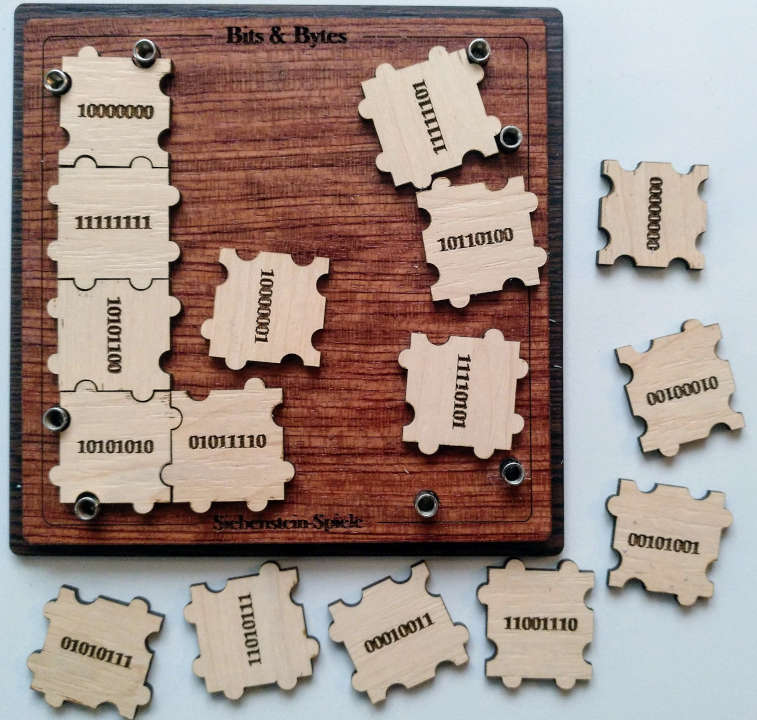
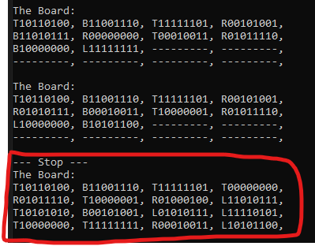

# Bits & Bytes puzzle solver

This script can be used to solve a Bits&Bytes puzzle like this one:



## Puzzle

The puzzle has 16 parts and each part represents one byte (8 bit). Each side of a part has either two extends, one extend and one dent or two dents. Each 1 of the 8 bit is represented with an extend and each 0 with a dent.

The goal of the puzzle is to fit all 16 pieces into the frame.  

The script uses the [Sudoku Backtracking Technique](https://en.wikipedia.org/wiki/Sudoku_solving_algorithms) to find possible solutions for this puzzle.  

*I was not able to find any other pattern or system to solve this puzzle. If you know a better approach to solve this (via script or by hand) please let me know.* :D

## Usage

- All parts of the puzzle are defined in the `puzzlePieces.json`  
  - Each part is defined by an dict entry like this:  

```json
  "01010111": {
        "rotation": "T",
        "pins": [0, 1, 0, 1, 0, 1, 1, 1]
    }
```  

- Value explanation:
  - `rotation` can be T (Top), R (Right), B (Bottom), L (Left) and describes the side that is on top.  
  - `pins` represent the placing of the extends and dents of the part. Clockwise starting from the Top left.  

### How to run

1. Install the requirements listed below.
2. Run `python bits_and_bytes_solver.py -r -sr -f ./puzzleParts.json -m bt`
3. The script will try to solve the puzzle based on the parts defined in `puzzlePieces.json` and provide the final solution on the command line.



*Again: The letter describes the orientation that needs to be up and the 8 bit define the part that you need to use!*

### Help

```cli
$ python bits_and_bytes_solver.py --help
Usage: bits_and_bytes_solver.py [OPTIONS]

Options:
  -r, --random            Use the -r flag if you want to shuffle the list
                          after the import.
  -sr, --superrandom      Use the -sr flag: Superrandom will shuffle the list
                          of left parts and the orientation each iteration in
                          the backtracking algorithm. (This does not affect
                          the bruteforce aproach!)
  -f, --filepath PATH     Provide the file path to your json file containing
                          all parts of the game.
  -m, --mode [bf|bt]      Choose a mode for solving the puzzle. bt =
                          backtracking | bf = bruteforce
  -p, --progress INTEGER  Choose a value between 0 and X>0. Each X iterations
                          the programm will give a short status update.
                          Setting the value to 0 will disable the status
                          update! [default=10000]
  -rt, --runtime FLOAT    Choose a max runtime in minutes. Reached the max
                          runtime the programm will stop. Setting the value to
                          0 will disable the max time! [default=1]
  --help                  Show this message and exit.
```

### Requirements

Install by running `pip install -r requirements.txt`

- Default packaged (should be already included in python3)
  - `os.path`
  - `json`
  - `collections`
  - `random`
- For managing command line parameters
  - `click`

## Ideas for future extentions of this script

- Reinforced Learning (AI) attempt (because AI ;) ) 
- Brute Force approach
- Measuring the number of possible Solutions
- Depth of recursion
- Stastistical comparison of using a random part list
- Finding satisfying patterns
- Developing a web interface
- Graphical respresentations
  - Gaussian normal distribution  
  - Graph with X time line and Y depth of recursion  
  - Frequency distribution of orientation  
  - Frequency distribution of each Field  
  - Frequency neighborhood bonds  
